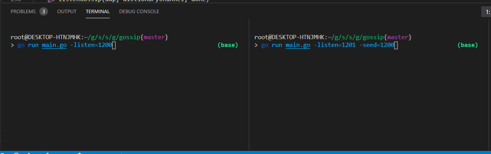

# Index

## Math

### Theory

[Geometric Interpretation of Covariance](texts/math/Statistics/GeometricInterpretationOfCovarianceMatrix.pdf)  
[Maximum Likelihood Estimation](texts/math/Statistics/maximumlikelihood.pdf)  
[Probability as Set Measure](texts/math/probability)

### Handouts

[Log](texts/math/Handout.Log.pdf)  
[Exponentials](texts/math/Handout.Exp.pdf)  
[Binomial Coefficient](texts/math/Handout.BinomialCoeffecient.pdf)  
[Series](texts/math/Handout.Series.pdf)  
[Fibonacci Numbers](texts/math/Handout.Fibonnaci.pdf)  
[Calculus](texts/math/Handout.Calculus.pdf)  
[Real Analysis](texts/math/realanalysis.pdf)

### Probability and Statistics

[Probability](texts/math/Handout.Probability.pdf)  
[Statistics](texts/math/Handout.Stats.pdf)  
[Asymptotic Statistics](texts/math/AsymptoticStatistics.pdf)  
[Linear Regression](texts/math/Handout.LinearRegression.pdf)

[Introduction to Probability Solutions](books/IntroductionToProbability/Solutions.pdf)

### Linear Algebra

[Singular Value Decomposition (SVD)](/texts/math/linearalgebra/svd.md)

### Problems

[Car out of Gas, Likelihood and statistics using R](texts/math/Statistics/CarOutGas)

## Computer Science

[Server Architecture](texts/dev/ServerArchitectureWindowsAPIandASPNET.pdf)  
[Can OO Strike Back?](books/TheTheoryOfObjects/CanOOStrikeBack.md)  
[Understanding SQL Server 2008 R2 Execution Plan - Part 1](texts/dev/Understanding%20SQL%20Server%202008%20R2%20Execution%20Plan%20-%20Part%201.pdf)  
[Who is Afraid of Parsing](texts/dev/WhoIsAfraidOfParsing.md)  
[C++ Performance: Packed array and Valgrind](sources/cpp/packedvsnode/readme.md)

### leetcode/hackerrank

[leetcode - 26 - Remove Duplicates from Sorted Array](./sources/leetcode/26-remove-duplicates-from-sorted-array) [c++](./sources/leetcode/26-remove-duplicates-from-sorted-array/main.cpp), [rust](./sources/leetcode/26-remove-duplicates-from-sorted-array/main.rs)  
[leetcode - 146 - LRU Cache](./sources/leetcode/146-lru-cache)  
[leetcode - 235 - Lowest Common Ancestor of a Binary Search Tree](./sources/leetcode/235-lowest-common-ancestor-of-a-235-lowest-common-ancestor-of-a-binary-search-tree)  
[leetcode - 236 - Lowest Common Ancestor of a Binary Tree](./sources/leetcode/236-lowest-common-ancestor-of-a-binary-tree)  
[leetcode - 295 - Find Median from Data Stream](./sources/leetcode/295-find-median-from-data-stream)  
[leetcode - 480 - Sliding Window Median](./sources/leetcode/480-sliding-window-median)  
[Other Leetcode Submissions](/sources/leetcode) (some have tutorial/references etc...)  
[hackerrank - Array Manipulation](/sources/hackerrank/array-manipulation)  
[hackerrank - Fraudulent Activity Notifications](/sources/hackerrank/fraudulent-activity-notifications)  
[hackerrank - Heaps: Find the Running Median](/sources/hackerrank/heaps-find-the-running-median)  
[hackerrank - Find the Running Median](/sources/hackerrank/find-the-running-median)  
[hackerrank - Binary Search Tree Lowest Common Ancestor](/sources/hackerrank/BinarySearchTreeLowestCommonAncestor)

### Computer Graphics/Gamedev

[Computer Graphics Guide](/texts/dev/ComputerScience/Computer%20Graphics)  
[webGPU](/sources/javascript/webgpu/Readme.md)  
[Unreal Engine - Localization](/sources/unreal/localization/Readme.md)  
[Unreal Engine - Basic locomotion using Mixamo](/sources/unreal/locomotion/Readme.md)  
[Unreal Engine - Writing Complex Unreal functions in C++](/sources/unreal/complexlatentfunction/Readme.md)

### Concurrency

[Concurrency](/texts/dev/ComputerScience/Concurrency)

### Algorithms and Data Structures

[Compression - LZ77](sources/javascript/compression/)  
[CRTD - Conflict-free Replicated Data Type](courses/kth-distributed-algorithms-1/crt)  
[Bitfield](sources/cpp/bitfield)  
[Memory Allocator](/sources/cpp/memory)

### Linux

[Linux Kernel Development](sources/unix/moddev/readme.md)

### Machine Learning

[Neural Network inside Browsers (Pytorch + ONNX + ONNXJS)](./sources/machinelearning/onnxjs)

### Languages

### C#

[C# Index](sources/csharp/Readme.md)

#### C/C++

[C++ Index](sources/cpp/readme.md)  
[C++ Coroutines (even for WebAssembly)](sources/cpp/coroutines/)  
[Command line Debugging](sources/cpp/CommandLineDebug.md)  
[Cache LRU](sources/cpp/lru)  
[Functional (Curry, Partial Binding and Pipeline)](./sources/cpp/func/)

#### R

[Realtime London Underground Position](https://rstudio-pubs-static.s3.amazonaws.com/269780_73750785d8c04f9e968287701e22af30.html)

#### Javascript

[React + Freezer](sources/javascript/react+freezer)

#### WebAssembly

##### WebAssembly Series

[Index](/sources/webassembly)

01 - [WebAssembly with C/C++](/sources/webassembly/wasm.001.md)

        01.1 - Compiling the compiler (LLVM)
        01.2 - Installing Dependencies
        01.3 - Compiling our WASM file
        01.4 - Peeking inside the LLVM ll file
        01.5 - Linking the WASM file
        01.6 - The Whole Process
        01.7 - Using wasmer

02 - [Running Webassembly inside browsers](/sources/webassembly/wasm.002.md)

        02.1 - Creating host application
        02.2 - Loading WASM using ParcelJS integration
        02.3 - Loading WASM manually
        02.4 - Enabling Console.Log
        02.5 - Peeking inside the WASM file

03 - [Javascript/Webassembly Interaction and Memory Layout](/sources/webassembly/wasm.003.md)

    03.1 - More complex interactions
    03.2 - Returning a Struct and Memory Operations
    03.3 - Calling the generated Wasm and reading Memory
    03.4 - Wasm Memory Layout

[C++ Coroutines (even for WebAssembly)](sources/cpp/coroutines/)

[WASM presentation](https://github.com/xunilrj/sandbox/blob/master/sources/webassembly/workshop/Readme.md)  
[WASM presentation - PT/BR](https://www.youtube.com/watch?v=YYeqRMqn774)

#### Rust

[Generational Index](sources/rust/generational_index)

Chat  
[low level HTTP using MIO](https://github.com/xunilrj/sandbox/tree/master/sources/rust/chat)  
[scalability using Cassandra/ScyllaDB](https://github.com/xunilrj/sandbox/tree/master/sources/rust/chat-ws)

SSTable  
[Simple Trait based SSTable](https://github.com/xunilrj/sandbox/tree/master/sources/rust/sstable)

RCU - Read-Copy-Update  
[Concurrent FIFO](https://github.com/xunilrj/sandbox/tree/master/sources/rust/rcu-test)

Multithread Columnar DB  
[DB](https://github.com/xunilrj/sandbox/tree/master/sources/rust/columnar-db)

RELM - Rust ELM
[Relm](https://github.com/xunilrj/sandbox/tree/master/sources/rust/relm)

Merkle Tree
[Merkle Tree](https://github.com/xunilrj/sandbox/tree/master/sources/rust/merkle-tree)

Writing an Async Runtime
[Async Runtime](https://github.com/xunilrj/sandbox/blob/master/sources/rust/async-runtime/Readme.md)

Bidirectional Type Cheker
[Type Checker](https://github.com/xunilrj/sandbox/blob/master/sources/rust/type_checker/Readme.md)

#### Go

IETF Servers:

[daytime](https://github.com/xunilrj/sandbox/tree/master/sources/golang/ietf-servers/daytime)  
[echo](https://github.com/xunilrj/sandbox/tree/master/sources/golang/ietf-servers/echo)

Gossip:

[UDP Gossip](https://github.com/xunilrj/sandbox/tree/master/sources/golang/gossip)  

# Courses

[columbia-cg-animation](./courses/columbia-cg-animation)  
[columbia-ia](./courses/columbia-ia)  
[columbia-robotic](./courses/columbia-robotic)  
[coursera-princeton-algorithms-1](./courses/coursera-princeton-algorithms-1)  
[coursera-sandiego-algorithms](./courses/coursera-sandiego-algorithms)  
[ImperialCollege-LinearAlgebra](./courses/ImperialCollege-LinearAlgebra)  
[IMTx-Queue-Theory](./courses/IMTx-Queue-Theory)  
[johnhopkins-datascience](./courses/johnhopkins-datascience)  
[kth-distributed-algorithms-1](./courses/kth-distributed-algorithms-1)  
[NewYorkBuffalo-ComputerVision](./courses/NewYorkBuffalo-ComputerVision)  
[university-of-texas-linear-algebra](./courses/university-of-texas-linear-algebra)  
[UTAustinX UT.PHP.16.01x](./courses/UTAustinX%20UT.PHP.16.01x)

# Stackoverflow Answers

## C# and .NET

### UnitOfWork, Repository Database Connection Issue

about IoC container Unity  
https://stackoverflow.com/questions/39954586/unitofwork-repository-database-connection-issue/40418462#40418462

### Why does 'unbox.any' not provide a helpful exception text the way 'castclass' does?

about how the .NET JIT works  
https://stackoverflow.com/questions/39914845/why-does-unbox-any-not-provide-a-helpful-exception-text-the-way-castclass-do/40073409#40073409

### Cancel Specific Task using CancellationToken

How TPL works  
https://stackoverflow.com/questions/35816146/cancel-specific-task-using-cancellationtoken/35817808#35817808

## C++

### iterator over non-existing sequence

how to create C++ iterators  
https://stackoverflow.com/questions/38730479/iterator-over-non-existing-sequence/38772065#38772065

### Non-Copyable, Moveable only wrapper for OS handles

Shoud Non-Copyable class have user conversion
https://stackoverflow.com/questions/54963695/shoud-non-copyable-class-have-user-conversion#54963784

## SQL Server

### Log file is growing with Simple Recovery mode

how SQL Server internals works  
https://stackoverflow.com/questions/38590066/log-file-is-growing-with-simple-recovery-mode/38592482#38592482

## Theory

### What's the difference between deadlock and livelock?

https://stackoverflow.com/questions/6155951/whats-the-difference-between-deadlock-and-livelock/35129823#35129823
