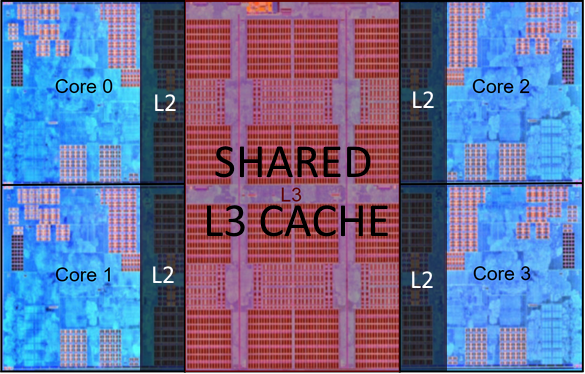
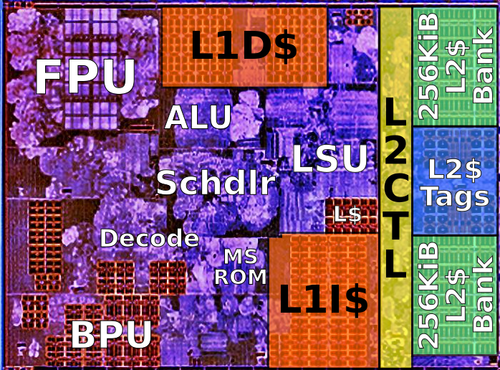

# Introduction

So here we are going to analyze the impact of data structure on a very simple example. In very broad terms, that is what we are doing.  
1 - Sum a float array;  
2 - Sum the property "x" of a struct array.  

We want to gather information if this only and small design difference can generate relevant performance impact.

```c++
...
struct SomeData
{
    char junk[32];
    float x;
    char doesntMatter[32];
};
..
int main(int argc, char** argv)
{
    ...
            float* f = new float[size];

            float accum = 0;
            for(int i = 0; i < size; ++i)
            {
                accum += f[i];
            }

            delete[] f;
    ...
            SomeData* arr = new SomeData[size];

            float accum = 0;
            for(int i = 0; i < size; ++i)
            {
                accum += arr[i].x;
            }

            delete[] arr;
    ...
}
```

Our little program accepts two parameters: "col" and/or "row".

If we pass "col", it runs the "sum" on the float array.

```c++
float* f = new float[size];

float accum = 0;
for(int i = 0; i < size; ++i)
{
    accum += f[i];
}

delete[] f;
```

 If we pass "row" it runs on the struct.

 ```c++
SomeData* arr = new SomeData[size];

float accum = 0;
for(int i = 0; i < size; ++i)
{
    accum += arr[i].x;
}

delete[] arr;
```

The program will output a "CSV" table with the columns:

1 - The arguments. One in each line;  
2 - A csv table with three columns;  
2.1 - Size of the array;  
2.2 - Time in seconds to sum the "col" (float array);  
2.3 - Time in seconds to sum the "row" (struct array). 

So, for example.

```
> ./a.out col row
0:./a.out
1:col
2:row
size;colunar;row
1000;0;0;
10000;0;0;
100000;0;0.006;
1000000;0.006;0.065;
10000000;0.068;0.684;
```

Maybe this is a surprise for you, but the "col" case (float array) is 10 times faster! It took 0.684 seconds agains 0.068. If you are surprised, and want to know what is happenning here, please continue reading.

## Valgrind

To gather information to understand what is happening here, we will use "Valgrind".

Valgrind is an virtual-machine that record information about memory read, write and cache (and other informations). Maybe it is not clear why we gathering this information to understand this case. It will become clear at the end, I hope.

But one of the reasons why we are investigating memory is stated inside the "Valgrind" manual.

```
On a modern machine, an L1 miss will typically cost around 10 cycles, 
an LL miss can cost as much as 200 cycles, and a mispredicted branch 
costs in the region of 10 to 30 cycles. Detailed cache and branch 
profiling can be very useful for understanding how your program 
interacts with the machine and thus how to make it faster.
```
https://valgrind.org/docs/manual/cg-manual.html  

If you do not remember, or do not know, what a cache miss is, let us make a quick recap first.

## ASM, CPU Architecture Recap

The way that CPUs work is through instructions. Each command is store in binary, off course, but for human readability they have mnemonics. For example:

```asm
ADD RAX, RBX
```
https://www.felixcloutier.com/x86/add  

This instruction would just do "RAX += RBX". Where "RAX" and "RBX" are register inside the CPU. You can imagine CPU register as variables (in this case ints) that reside inside the CPU and so have "zero" cost of access.

Although it is insanely difficult to actually estimate the cost of an instruction, a "ADD" like this using only registers takes just one cycle.

```
Instruction Operands    Ops Latency
ADD, SUB    r,r/i       1   1      
page 28
```
https://www.agner.org/optimize/instruction_tables.pdf  

So a computer with an 1GHz cpu would do 1 billion of "ADD"s like this one. The problem is, how do you put the values we want to sum inside the CPU registers. To do this you have to use another instruction:

```asm
MOV RAX, [MEM ADDR]
MOV RBX, [MEM ADDR]
```
https://www.felixcloutier.com/x86/mov  

So with these we move from some memory location to those registers. After this we can sum them. Let us ignore for now how do I know the address that I want to load from.

```asm
MOV RAX, [0x100]
MOV RBX, [0x104]
ADD RAX, RBX
```

Moving cost a little more than summing two registers.

```
Instruction Operands    Ops Latency
MOV         r64,m64     1   3
page 28
```
https://www.agner.org/optimize/instruction_tables.pdf  

"Latency" three means that it takes, as the "Agner" documentations states, at  minimum three cycles to complete. In this particular case is the very-very-minimum, because as we saw in "Valgrind" manual, it can actually take hundreds of cycles. If you are really unlucky it can actually take thousands and thousand of cycles (some milliseconds, but let us ignore this for now).

Tallying up how many cycles out little program would take, we have:

```asm
MOV RAX, [0x100]    # 200 cycles
MOV RBX, [0x104]    # 200 cycles
ADD RAX, RBX        # 1 cycle
```

401 cycles. But...

Because accessing memory is to slow from the CPU perspective, CPU architects envisioned faster layers of memory to speed this access up. So instead of always going to the biggest/slowest memory, the CPU caches and tries to access the same information in faster memories. Today is common to have three levels of memory.

These levels generate a pyramid of memory. At the very top are CPU registers, very fast, but very limited. Only 15 for integers; the second level is called L1. Is a very fast memory. Slower than registers, but almost as good. But they also small.

For example my computer has 32KB for L1 cache. Better than 15 ints, but insanely small for today standards. What program could you make using only 32KB?

```
> getconf -a|grep LEVEL1_DCACHE
LEVEL1_DCACHE_SIZE                 32768
LEVEL1_DCACHE_ASSOC                8
LEVEL1_DCACHE_LINESIZE             64
```

Below L1 is, off course, L2. Slower to access, but bigger. In my case 512KB. And L3, 16MB. Already interesting.

```
> getconf -a|grep LEVEL2
LEVEL2_CACHE_SIZE                  524288
LEVEL2_CACHE_ASSOC                 8
LEVEL2_CACHE_LINESIZE              64
> getconf -a|grep LEVEL3
LEVEL3_CACHE_SIZE                  16777216
LEVEL3_CACHE_ASSOC                 16
LEVEL3_CACHE_LINESIZE              64
```

The main difference here, is that L1 exist inside each CPU chip; L2 is outside but exist for each CPU; and the L3 is shared across all CPUs. This makes a huge difference.

So to get more real, more physical, let us dive deep into an AMD CPU. Only because is the CPU that I am using it now.

```
> cat  /proc/cpuinfo|grep name
model name      : AMD Ryzen 7 1700 Eight-Core Processor
model name      : AMD Ryzen 7 1700 Eight-Core Processor
model name      : AMD Ryzen 7 1700 Eight-Core Processor
model name      : AMD Ryzen 7 1700 Eight-Core Processor
model name      : AMD Ryzen 7 1700 Eight-Core Processor
model name      : AMD Ryzen 7 1700 Eight-Core Processor
model name      : AMD Ryzen 7 1700 Eight-Core Processor
model name      : AMD Ryzen 7 1700 Eight-Core Processor
model name      : AMD Ryzen 7 1700 Eight-Core Processor
model name      : AMD Ryzen 7 1700 Eight-Core Processor
model name      : AMD Ryzen 7 1700 Eight-Core Processor
model name      : AMD Ryzen 7 1700 Eight-Core Processor
model name      : AMD Ryzen 7 1700 Eight-Core Processor
model name      : AMD Ryzen 7 1700 Eight-Core Processor
model name      : AMD Ryzen 7 1700 Eight-Core Processor
model name      : AMD Ryzen 7 1700 Eight-Core Processor
```

You can read all at: https://en.wikichip.org/wiki/amd/microarchitectures/zen
But for a more succinct description, and what matters to us here you can just continue.

### Inside the CCX (Core Complex)

Here we have a "photo" of chip, a part of the CPU. 
  
1 - We are seeing four cores;  
2 - Cache L3 is shared, and takes a lot of the CCX space;  
3 - Cache L2 is not inside the core but is replicated to each core;  
4 - We are not seeing cache L1 because it sits inside the core.  

Given that my computer has 8 physical cores, I have two of these. How they communicate is not important here.
  


### Inside the Core

The things to understand here are:
  
1 - Cache L2 outside, but near the core. 512KB for each core;  
1.1 - "L2CTL" means "Level 2 Controller". It decides if the memory location you a reading is inside the L2 (using the L2$Tags) and in which "bank" its located (L2$Bank1 or L2$Bank 2);  
2 - "L1I$" is the L1 cache ONLY for instructions;  
3 - "L1D$" is the L1 cache ONLY for data;  
4 - ALU is the chip the runs Arithmetic instructions with integers;  
5 - FPU is the chip the runs Arithmetic instructions with floats;  
6 - BPU is the chip that optimize decisions (if, for, function calls , jumps etc...);  
7 - LSU is the chip that manage load/store from memory.
7.1 - L$ is the store of what is inside the L1 cache;
8 - "Decode" is the chip that decode the binary instructions to actual CPU commands;
9 - "Schdlr" means scheduler and is the chip that organize everything.
  


It is clear that things that work together are near together.

- ALU and FPU work with registers (inside its own chips) and memory, so they are near the "Data Cache";
- BPU and Decode work with instructions so they are near the "Instruction Cache";
- When we have a "Level 1 Cache Miss" we pass the read to the "Level 2". So both "Instruction Cache" and "Data Cache" are near the LSU

It is also clear why higher levels of cache are slower. It not only a matter of "better" or "faster" memory. They are behind increasing number of chips.

If you are "summing" two memories inside the "Data Cache" you request passed through:

1 - LSU  
2 - LSU verifies if the memory address is inside the L$;  
2 - Read from "L1D$"  

If you need to go to L2 you have:

1 - LSU;  
2 - LSU verifies if the memory address is inside the L$;  
3 - L1 Cache Miss;  
4 - L2CTL;  
5 - LSCTL verifies if the memory address is inside the "L2$ Tags";  
6 - Read from "L2$ Bank 1" or "L2$ Bank 2".  

and the same thing happen when we go to Level 3. The difference here is that "Level 3" is shared. Which means we can have contention.

Let us zoom on the CCX again. If the step 5 fail and we have a "L2 Cache Miss" we need to go to the "L3 Cache" or as "Valgrind called it" "Last Level Cache".

Level 3 is shared, in my case here between four cores. The Same logic applies here. "Level 2 Controller" pass the read to "Level 3 Controller. 

But suppose that by pure chance all four "Level 2 Controllers" pass at the exact same time reads to the "Level 3 Controller" to read the same memory address. They will all go for the same "L3 Block" and we will have read contention.

Off course we do not need to read the exact same memory address to have contention here. We just need to have the bad luck to end in the same "L3 Block".


Enough of theory, let us see the program running.

# Execution


Now let us see how the "col" execution.

## Valgrind about "col" execution

```
> valgrind --tool=cachegrind ./a.out col
==3987== Cachegrind, a cache and branch-prediction profiler
==3987== Copyright (C) 2002-2015, and GNU GPL'd, by Nicholas Nethercote et al.
==3987== Using Valgrind-3.11.0 and LibVEX; rerun with -h for copyright info
==3987== Command: ./a.out col
==3987==
--3987-- warning: L3 cache found, using its data for the LL simulation.
==3987== error calling PR_SET_PTRACER, vgdb might block
0:./a.out
1:col
size;colunar;row
1000;0;
10000;0;
100000;0.005;
1000000;0.055;
10000000;0.546;
==3987== 
==3987== I   refs:      135,639,615
==3987== I1  misses:          1,941
==3987== LLi misses:          1,871
==3987== I1  miss rate:        0.00%
==3987== LLi miss rate:        0.00%
==3987==
==3987== D   refs:      100,773,214  (78,342,402 rd   + 22,430,812 wr)
==3987== D1  misses:        711,908  (   709,360 rd   +      2,548 wr)
==3987== LLd misses:        641,864  (   640,335 rd   +      1,529 wr)
==3987== D1  miss rate:         0.7% (       0.9%     +        0.0%  )
==3987== LLd miss rate:         0.6% (       0.8%     +        0.0%  )
==3987==
==3987== LL refs:           713,849  (   711,301 rd   +      2,548 wr)
==3987== LL misses:         643,735  (   642,206 rd   +      1,529 wr)
==3987== LL miss rate:          0.3% (       0.3%     +        0.0%  )
```

Let us break this output line-by-line, when necessary.

```
> valgrind --tool=cachegrind ./a.out col
```

This is our command line, off course. "./a.out" is our executable name. "col" means that we are running just the "col" or packed example.

```
==3987== Cachegrind, a cache and branch-prediction profiler
==3987== Copyright (C) 2002-2015, and GNU GPL'd, by Nicholas Nethercote et al.
==3987== Using Valgrind-3.11.0 and LibVEX; rerun with -h for copyright info
==3987== Command: ./a.out col
==3987==
```

Here "Valgrind" is just confirming our command line. So far so good.

```
--3987-- warning: L3 cache found, using its data for the LL simulation.
```

Ok, here we have the first important info. "Valgrind" identified that my computer have three levels of cache. These days, L1 and L2 are inside the core chip, therefore are faster.

L3, level three, is shared between all cores.

In a NUMA environment the L3 is not shared across NUMAs, just between cores of one of the NUMAs.

The important part here is that L3 is being considered as LL, the "Last Level" of cache. We will see some statistics about this later.

```
==3987== error calling PR_SET_PTRACER, vgdb might block
```

We will ignore this for now.

```
0:./a.out
1:col
size;colunar;row
1000;0;
10000;0;
100000;0.005;
1000000;0.055;
10000000;0.546;
```

This is the output of our program.

First two lines are the arguments passes. Confirming that we are running just the "col" for now. Then we have the timing. Everything as expected. Every time we increase the size by 10 we take 10 times more time. It is good when things make sense.


```
==3987== 
==3987== I   refs:      135,639,615
==3987== I1  misses:          1,941
==3987== LLi misses:          1,871
==3987== I1  miss rate:        0.00%
==3987== LLi miss rate:        0.00%
```

"I" here is for the instruction cache. I1 is for the level one cache for instruction, and LLi is for the "last level" of cache for instructions. In our case here we now that this is L3.

"I refs" so is the number of instructions read. Off course that our program does not have 135M of instructions. We achieve this number because of our loops. The interesting thing about this number is that, sometimes, less instructions means faster code. If you decrease the number of instructions without adding branches, indirections etc... you are probably optimizing your code. OK, so we read 135M instructions.

"I1  misses" is of course how many times we tried to find the "next instruction" on the L1 for instruction and failed. The number itself if hard to analyze if it is good or bad. Again when comparing implementations decreasing this number is good.

"LLi misses" is really THE problem when comes to instruction cache miss, because we failed to find our code on the "last cache". 

"I1  miss rate" and "LLi miss rate" are probably the important ones here, because they summarize both misses in terms of how many instructions were read. In out case here, "0.00%" is an approximation because we had cache misses, off course, but they are negligible. In summary they are just ("I1  misses"/"I refs" and "LLi misses"/"I refs").

On instructions I think we are fine for now.

```
==3987== D   refs:      100,773,214  (78,342,402 rd   + 22,430,812 wr)
==3987== D1  misses:        711,908  (   709,360 rd   +      2,548 wr)
==3987== LLd misses:        641,864  (   640,335 rd   +      1,529 wr)
==3987== D1  miss rate:         0.7% (       0.9%     +        0.0%  )
==3987== LLd miss rate:         0.6% (       0.8%     +        0.0%  )
```

"D" is about the data memory cache.

"D   refs" is how many times the memory was touched. "rd" how many times was read, and "wr" how many times was written. In out case 100M times, being 78M reads and 22M writes.

"D1  misses" is how many times we missed our data on the L1 cache. Again aggregated (711K times) and by reads (709K) and writes (2k) times. Up until now it is pretty clear that we are "read dominated". Even if you find a magical way to decrease the number of writes, it would not make a huge difference.

"LLd misses" is how many times we failed on the last level of cache. In terms of memory time cost, this is the big villain. Every time you magically decrease this number you will see improvements in performance.

"D1  miss rate" and "LLd miss rate" are, off course, in comparison with the amount of memory read/writes. We are pretty good actually. And this is the whole point of this article. When we access data in a contiguous array, as the "cache predictor" is expecting, we have very little L1 and L3 misses and this improves our performance A LOT. This, in a lot of cases, beats algorithmic complexity.

```
==3987== LL refs:           713,849  (   711,301 rd   +      2,548 wr)
==3987== LL misses:         643,735  (   642,206 rd   +      1,529 wr)
==3987== LL miss rate:          0.3% (       0.3%     +        0.0%  )
```

The last section is just a summary.

"LL refs" is the sum of "LLi refs" and "LLd refs" (both do not appear in the output).  
"LL misses" is the sum of "LLi misses" and "LLd misses".  
"LL miss rate" is a misleading one. It is NOT "LL misses"/"LL refs" but "LL misses"/("I refs"+"D refs").  

Now let us see how the "row" stands against "Valgrind".

## Valgrind about "row" execution

```
> valgrind --tool=cachegrind ./a.out col
> valgrind --tool=cachegrind ./a.out row
==4053== Cachegrind, a cache and branch-prediction profiler
==4053== Copyright (C) 2002-2015, and GNU GPL'd, by Nicholas Nethercote et al.
==4053== Using Valgrind-3.11.0 and LibVEX; rerun with -h for copyright info
==4053== Command: ./a.out row
==4053==
--4053-- warning: L3 cache found, using its data for the LL simulation.
==4053== error calling PR_SET_PTRACER, vgdb might block
0:./a.out
1:row
size;colunar;row
1000;0.001;
10000;0.001;
100000;0.013;
1000000;0.129;
10000000;1.371;
==4053== 
==4053== I   refs:      157,863,039
==4053== I1  misses:          1,940
==4053== LLi misses:          1,880
==4053== I1  miss rate:        0.00%
==4053== LLi miss rate:        0.00%
==4053==
==4053== D   refs:      100,773,688  (78,342,700 rd   + 22,430,988 wr)
==4053== D1  misses:     11,128,717  (11,126,135 rd   +      2,582 wr)
==4053== LLd misses:     11,021,134  (11,019,573 rd   +      1,561 wr)
==4053== D1  miss rate:        11.0% (      14.2%     +        0.0%  )
==4053== LLd miss rate:        10.9% (      14.1%     +        0.0%  )
==4053==
==4053== LL refs:        11,130,657  (11,128,075 rd   +      2,582 wr)
==4053== LL misses:      11,023,014  (11,021,453 rd   +      1,561 wr)
==4053== LL miss rate:          4.3% (       4.7%     +        0.0%  )
```

This time we will not analyze the output line-by-line, off course. We will go directly to the values and compare them. First let us start with timing. We saw that "col" was much faster, let us see if "Valgrind" preserve this.  

```
size;colunar;row
1000;0;
10000;0;
100000;0.005;
1000000;0.055;
10000000;0.546;
```

versus  

```
1000;0.001;
10000;0.001;
100000;0.013;
1000000;0.129;
10000000;1.371;
```

And yes, it is much worse. The absolute value here does not matter, because we are running a debug compilation using "Valgrind". But it is easy to see that "col" is much better. And this IS the reason of this article and let us see why now.

First let us see if the difference lies on number of instructions:

```
==3987== I   refs:      135,639,615
```

versus 

```
==4053== I   refs:      157,863,039
```

Well, the "row" version is indeed worst in this dimension. But it is enough to explain almost 3x worse? Probably not. Let us jump to the others statistics and can see later the difference in the generated asm.

```
==3987== I1  misses:          1,941
==3987== LLi misses:          1,871
==3987== I1  miss rate:        0.00%
==3987== LLi miss rate:        0.00%
```

versus 

```
==4053== I1  misses:          1,940
==4053== LLi misses:          1,880
==4053== I1  miss rate:        0.00%
==4053== LLi miss rate:        0.00%
```

Not a lot of difference is terms of instruction cache miss.


```
==3987== D   refs:      100,773,214  (78,342,402 rd   + 22,430,812 wr)
==3987== D1  misses:        711,908  (   709,360 rd   +      2,548 wr)
==3987== LLd misses:        641,864  (   640,335 rd   +      1,529 wr)
==3987== D1  miss rate:         0.7% (       0.9%     +        0.0%  )
==3987== LLd miss rate:         0.6% (       0.8%     +        0.0%  )
```

versus 

```
==4053== D   refs:      100,773,688  (78,342,700 rd   + 22,430,988 wr)
==4053== D1  misses:     11,128,717  (11,126,135 rd   +      2,582 wr)
==4053== LLd misses:     11,021,134  (11,019,573 rd   +      1,561 wr)
==4053== D1  miss rate:        11.0% (      14.2%     +        0.0%  )
==4053== LLd miss rate:        10.9% (      14.1%     +        0.0%  )
```

OK! It is pretty obvious that we are at the heart of the problem. Although the number of memory access are pretty much the same: 100M; the number of L1 and L3 misses ar insanely bigger for the "row" approach.

Remember that cache misses are not free. Every one of them cost time. As "Valgrind" documentation states, a L3 cache miss can cost 200 cycles. To better understand if this is the main cause of the performance problem here. Let us analyze is my case.

```
> cat  /proc/cpuinfo|grep MHz
cpu MHz         : 3000.000
cpu MHz         : 3000.000
cpu MHz         : 3000.000
cpu MHz         : 3000.000
cpu MHz         : 3000.000
cpu MHz         : 3000.000
cpu MHz         : 3000.000
cpu MHz         : 3000.000
cpu MHz         : 3000.000
cpu MHz         : 3000.000
cpu MHz         : 3000.000
cpu MHz         : 3000.000
cpu MHz         : 3000.000
cpu MHz         : 3000.000
cpu MHz         : 3000.000
cpu MHz         : 3000.000
```

My computer has 16 cores, all of them at 3GHz. This means 3,000,000,000 cycles per second. Three billions cycles per second. Every L3 cache miss we waste 200 cycles. Does not seems much, right? But we had 11,021,134 cache misses. Eleven million. Multiplying them we get:

```
11,021,134 * 200 = 2,204,226,800 (73% of 3GHz)
```

2 billion cycles wasted. Almost a whole second of one of my CPUs!  

If you sum the difference of both timings together:  

```
size;colunar;row;difference
1000;0;0.001;0
10000;0;0.001;0
100000;0.005;0.013;0.008
1000000;0.055;0.129;0.074
10000000;0.546;1.371;0.825
```

Total difference is: 0.907 seconds. So from these 0.7 is basically the CPU halted waiting data from the memory because a L3 cache was missed.

But the question boils down to: why is the "row" case much worse in cache? Is there anything structural or relevant here that we must take into account? And the answer is YES. That is why so many databases choose to use a "columnar store" instead of a "row store" when the purpose of the data is to be aggregated.

## Data Layout

To understand the difference let us focus on the only two differences betweens the two cases:

```
float* f = new float[size];
```

versus 

```
struct SomeData
{
    char junk[32];
    float x;
    char doesntMatter[32];
};
```

We know that c++ arrays are packed in the sense that, in this case, every float is nest to the other.

```
-----------------------------------------------------
| 0x100 | 0x104 | 0x108 | 0x10C | 0x110 | 0x114 | ...
-----------------------------------------------------
|   0   |   0   |   0   |   0   |   0   |   0   | ...
-----------------------------------------------------

-----------------
|   f   | 0x100 |
-----------------
```

but for structs it, of course, dependes on the struct. Clang has an option that allow us to see the object layout. Let us use it:

```
> clang -cc1 -fdump-record-layouts myfile.cpp

*** Dumping AST Record Layout
         0 | struct SomeData
         0 |   char [32] junk
        32 |   float x
        36 |   char [32] doesntMatter
           | [sizeof=68, dsize=68, align=4,
           |  nvsize=68, nvalign=4]
```

We can easily see that the struct takes 68 bytes, and "x" is at offset 32. So when we create an array of "SomeData" they get pakced together, but the "x"s fields get apart from each other 68 bytes. This is called the stride.

```
-----------------------------------------------------
| 0x100         |     0x144     | 0x188 | ...
-----------------------------------------------------
|      ...      |      ...      |  ...  |  ... 
-----------------------------------------------------
    ^ 0x120         ^ 0x164
    |=> f[0].x      |=> f[1].x
    \_______________/
     68 bytes stride
      
-----------------
|   f   | 0x100 |
-----------------
```

This is very important here because the way the CPU cache works. In the happy case of a packed array when we access "f[0].x" the first time we will miss every cache level and we will need to bring data from memory.

Luckly, CPU engineers are smart and know that this process is very slow, in CPU time. So they bring not just the "4-bytes-you-ordered", but a chunk known as "cache line". Today "cache lines" have 64 bytes. In 64 bits computer this is 8 "words".

So the first time we read "f[0].x" we will actually bring 64 bytes from the memory to the L3 cache. In the packed array case this will automatically give us:

```
---------------------------------------------------------------
| f[0] | f[1] | f[2] | f[3] | f[4] | f[5] | f[6] | f[7] | ... |
---------------------------------------------------------------
```

So even if the "cache predictor" do nothing, we will gain "f[1]" to "f[7]" in the cache for free. Because of the "cache line" strategy. Now compare this with the struct.

The struct itself is bigger than the "cache line". So the first time I read "f[0].x", even bringing 64 more bytes, "f[1].x" will not be in the cache. So I will have automatically a cache miss in the next iteration.

Let us use a simple cost-of-access to measure the difference. Everything is free but:  
1 - Cache access cost 10  
2 - Memory access cost 200

This is not even close to the truth, but will do for now.

Packed case:

```
Read f[0] - 200
Read f[1] - 10
Read f[2] - 10
Read f[3] - 10
Read f[4] - 10
Read f[5] - 10
Read f[6] - 10
Read f[7] - 10
Read f[8] - 200
Read f[9] - 10
...
```

For the first 10 we have: 480.

Struct casse:

```
Read f[0].x - 200
Read f[1].x - 200
Read f[2].x - 200
Read f[3].x - 200
Read f[4].x - 200
Read f[5].x - 200
Read f[6].x - 200
Read f[7].x - 200
Read f[8].x - 200
Read f[9].x - 200
...
```

For the first 10, we have: 2000. Five times more.

And actually get worse. Why? Cache prefetching. This means that the CPU will try to antecipate you memory read pattern and will bring data from memory to the cache befor you ask.

Data cache prefetching is extremily difficult is various cases but one: linear access. So in this case, suppose the "prefetcher" suspects that we will read the chunk. We will have something like this.

```
Read f[0] - 200 - prefetcher reads next 8 bytes will take 200
Read f[1] - 10
Read f[2] - 10
Read f[3] - 10
Read f[4] - 10
Read f[5] - 10
Read f[6] - 10
Read f[7] - 10
Read f[8] - 130 - the remaining from the prefetcher read
Read f[9] - 10
...
```

versus

```
Read f[0].x - 200 - prefetcher reads next 8 bytes will take 200
Read f[1].x - 200 - outside prefetcher guess. No effect
Read f[2].x - 200
Read f[3].x - 200
Read f[4].x - 200
Read f[5].x - 200
Read f[6].x - 200
Read f[7].x - 200
Read f[8].x - 200
Read f[9].x - 200
...
```

So we have another advantage to having packed data. The "cache prefetcher" will anticipate our use.

## Prefetch builtin

In this simplistic scenario, we the "for" body is very small is hard to improve the situation of the "row" case. But one can always use some form of compiler intrinsics builtin to help the "cache prefetcher".

```
— Built-in Function: void __builtin_prefetch (const void *addr, ...)
This function is used to minimize cache-miss latency by moving data 
into a cache before it is accessed. 
```
https://gcc.gnu.org/onlinedocs/gcc-3.3.6/gcc/Other-Builtins.html

```c++
SomeData* arr = new SomeData[size];

float accum = 0;
for(int i = 0; i < size; ++i)
{
    accum += arr[i].x;
    __builtin_prefetch(&(arr[i+1].x), 1);
}

delete[] arr;
```

In this case this not only does not improve the performance, but can actually decrease, because the calculation of the next address is almost as costly as the calculation we do inside the for, doubling our work.