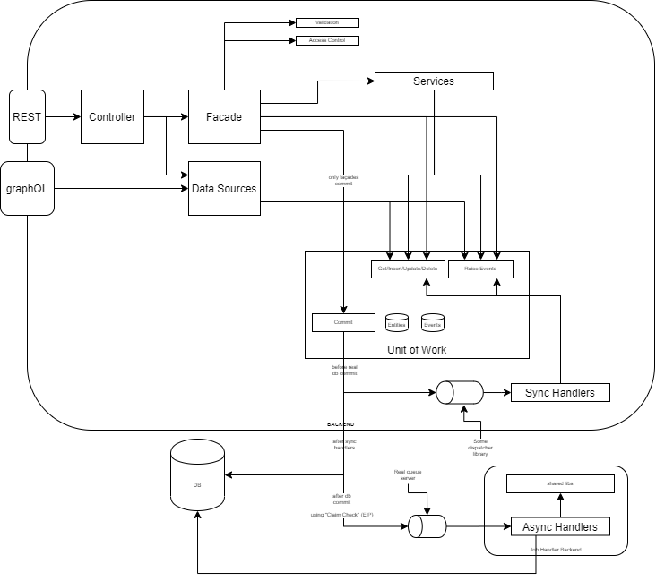

# Backend Architecture

  


Controllers/ASP.NET Core:  
- Call Façades and transform results in HTTP Responses.

Façades:

To avoid the façade-must-call-service-that-must-call-store rule, I like to put
non-repetitive logic directly on the façade. If something repeat we can promote it to a "Service".

- Validate authentication/authorization
- Validate input
- Orchestrate Services or Do the logic
- MUST Commit the transaction (only façades commit)
  - As o side-effect is generated before the commit is called, we can easily generate what-if. Useful for tests.

Services

- Do the logic
- NEVER validate authentication/authorization
- NEVER commit
- Must be composable/orchestratable (not a real word) by Façades

UoW (implement three interfaces)

- Implement generic store/repository: 
  - IQueryable<T> get<T>()  
  - T getById<T>(id)  
  - Pagination<T> paginate<T>(pagination)  
  - void insert<T>(T item)  
  - Task<T> insertReturn<T>(T item)  <- task only finished after commit (dangerous but usefull)
  - void update<T>(T item)  
  - Task<T> updateReturn<T>(T item)  <- task only finished after commit (dangerous but usefull)
  - void delete(T item)

- Implement domain event dispatcher
  - Task Raise(EventArgs)

- Implement ISaveChanges
  - Task Commit()

Most important method:  
 - Generate an EntityCreate, EntityUpdated, EntityDeleted for each operation (same order they happened)  
 - Dispatch all events (same order they happened) to "Sync Handlers"
   - "Sync Handlers" typically increase the semantic of events (when "Due Date" is changed send email to responsible". This handler NEVER send the email, just tell that an email must be sent.)
 - Open Transaction  
   - Send entities commands to the DB  
   - Save persisted events to the DB  
   - Commit Transaction  
   - Send messages to the queue
     - Preferably using "Claim Check Patern" (https://www.enterpriseintegrationpatterns.com/patterns/messaging/StoreInLibrary.html)
     - "Async Handlers" do the actual work. That email is sent here.

I understand that the most polemic part here is: "why saving the messages in the DB if we have a queue?"

Normally people do:

```
uow.Commit();
Queue.Dispatch(events);
```

Of course that in 99.999% of the cases, everything works, but when the "Dispatch" fails, the messages are lost. If this is OK, so this solution is fine.

If this is not OK, we need something better:
 - or we put DB and Queue in "distributed transaction";
   - in this case, how you backup/restore the system? Not easy.
 - or we persist everything in the DB.

The second is easier and scale much better (we can have multiple tables, partitioned tables to guarantee O(1) etc...)

The second point would be: "If we persisting messages in the DB, why even use a queue?"

The answer is: First because it is better. In the 99.99% of the cases, we never touch the "message table" so it is not onerous. Second, we may have non-persisted/it-doesnt-matter-if-we-lose-the-message messages (alert the user through Websocket that something happened, for example).

More:
"Life beyond Distributed Transactions: an Apostate’s Opinion"  
http://www-db.cs.wisc.edu/cidr/cidr2007/papers/cidr07p15.pdf

## Considerations when processing messages

All of this is, of course, possible using queue servers in general, but...

Another advantage of having the messages in the DB is to uniformally process messages using different messages servers. If you plan to send e-mail using a specific gateway that supports batches, you can easily get all email-messages, batch them, and send them (using transactions). Not something easily done in some queue servers.

Another advantage is that is very easy to implement poisonous-message handling (https://docs.microsoft.com/en-us/dotnet/framework/wcf/feature-details/poison-message-handling) when handling the message inside a transaction. It is very easy to append a metadata and or "remove" the message from a queue (https://www.enterpriseintegrationpatterns.com/patterns/messaging/InvalidMessageChannel.html).

Another point is, if you plan to use a SAGA (http://udidahan.com/2009/04/20/saga-persistence-and-event-driven-architectures) you are going to need a store anyway.

# REST and Testing

I like to test the REST API in two ways.

 - Integration tests actually calling the API using stubs where appropriate.
   - Avoid as MUCH as possible mocks.
   - Allow the application to be configured in a "test mode".
   - Use "Property Based Testing" (https://www.codit.eu/blog/property-based-testing-with-c)
     - Some endpoints behave like "collections", so I test them like collections.
       - If an item is not in the list and I insert it; it must be in the list.
       - etc...
     - Some endpoints behave like "state machines", so I test them like state machines.
       - If an item is in state X, and I can transition to state Y, and I do it; it must now be in state Y.
       - etc...
 - Normal Unit tests
   - I dislike the approach of testing if the controller calls the correct method of the façade using mocks, for example. In my experience, this generates a lot of useless tests that just cement the implementation.
   - Pure functional methods (no global/db/outside reads and no side effects) must be tested using Unit Test, of course.

# Extensions Methods and Monads

Monads are very useful, but generally is too thick to C# developers. I like to mix their gain with a still-looks-like-c# code using extension methods. Mainly on top of the Task class.

So instead of 

```
Task<Either<int,InvalidArgumentException>> doSomethingAsync(int value)
{
  ...
}

var result = (await doSomethingAsync(0)).map(x => x, err => 0);
```

Which does not looks natural C#. I prefer (even for non IO methods) to treat Task<T>/ValueTask<T> as the Either monad. It has a .Result and a .Exception. We lose the guarantees of the Either monad, but that is ok.

```
// non async example
ValueTask<int> doSomething(int value)
{
  ...
  if(...)
    return new InvalidArgumentException().AsValueTask(); // <- we never throw
  ...
  return value.AsValueTask();
}

var result = await doSomething(0)
  .whenOk(x => x) // <- unecessary, off course
  .WhenErr(err => 0);
```
# to ORM or to not ORM: that is th question

It is undeniable that ORMs help. But sometimes you struggle with their limitations (not optimal pagination, geospatial query, hierarchical column, graph queries, fulltext search etc...). In these cases I prefer to use a SQL builder directly.

QueryBuilder
https://github.com/sqlkata/querybuilder

I like to discriminate commands and queries, so inside the queries part of the application, I definitely prefer to use a querybuilder. 

We can avoid problems with magic-string with "nameof" (https://docs.microsoft.com/en-us/dotnet/csharp/language-reference/operators/nameof).

# Stackoverflow Answers

## C# and .NET

### UnitOfWork, Repository Database Connection Issue  
about IoC container Unity  
https://stackoverflow.com/questions/39954586/unitofwork-repository-database-connection-issue/40418462#40418462  

### Why does 'unbox.any' not provide a helpful exception text the way 'castclass' does?
about how the .NET JIT works  
https://stackoverflow.com/questions/39914845/why-does-unbox-any-not-provide-a-helpful-exception-text-the-way-castclass-do/40073409#40073409

### Cancel Specific Task using CancellationToken
How TPL works  
https://stackoverflow.com/questions/35816146/cancel-specific-task-using-cancellationtoken/35817808#35817808