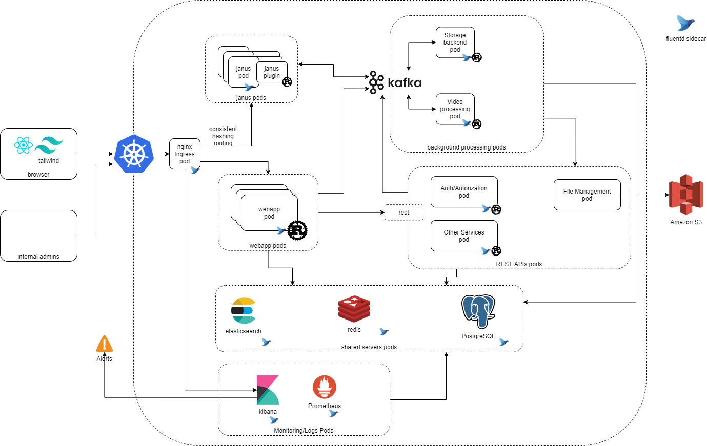

# Video Processing/Sharing Architecture

# Components

- Kubernetes
    - Deployment: https://aws.amazon.com/eks/
    - Development: https://github.com/kubernetes/minikube or https://github.com/kubernetes-sigs/kind
    - Logging
        - https://kubernetes.io/docs/concepts/cluster-administration/logging/
        - https://medium.com/kubernetes-tutorials/cluster-level-logging-in-kubernetes-with-fluentd-e59aa2b6093a
    - Monitoring/Metrics
        - https://devopscube.com/setup-prometheus-monitoring-on-kubernetes
        - https://www.elastic.co/blog/how-to-implement-prometheus-long-term-storage-using-elasticsearch
        - https://www.elastic.co/what-is/kibana-alerting

- Nginx Ingress
    - https://kubernetes.github.io/ingress-nginx
    - https://www.nginx.com/resources/wiki/modules/consistent_hash 

- Realtime Video (webRTC)
    - https://github.com/meetecho/janus-gateway
    - https://ourcodeworld.com/articles/read/1197/how-to-install-janus-gateway-in-ubuntu-server-18-04
    - Janus Plugins in RUST
        - https://crates.io/crates/janus-plugin

- Kafka
    - https://medium.com/swlh/apache-kafka-with-kubernetes-provision-and-performance-81c61d26211c
    - https://www.kai-waehner.de/blog/2020/08/07/apache-kafka-handling-large-messages-and-files-for-image-video-audio-processing/
    - Rust lib for Kafka
        - https://crates.io/crates/rdkafka

- Rest API
    - Actix
        - https://crates.io/crates/actix
        - https://crates.io/crates/actix-web
        - https://crates.io/crates/actix-web-prom
    - https://crates.io/crates/diesel
    - Logging
        - https://crates.io/crates/slog
        - https://crates.io/crates/slog-json
    - Config
        - https://crates.io/crates/structopt
        - https://crates.io/crates/serde
        - https://crates.io/crates/toml
    - Serialization
        - https://crates.io/crates/serde
        - https://crates.io/crates/toml
        - https://crates.io/crates/serde_json
    - Http
        - https://actix.rs/actix-web/actix_web/client/index.html
    - Amazon AWS
        - https://crates.io/crates/rusoto_core
        - https://crates.io/crates/rusoto_s3
    - https://crates.io/crates/elasticsearch
    - https://crates.io/crates/redis
    - https://crates.io/crates/prometheus

- Authentication
    - https://blog.logrocket.com/9-rust-authentication-libraries-that-are-ready-for-production
    - https://crates.io/crates/jsonwebtoken
    - https://crates.io/crates/otpauth
        - https://www.onelogin.com/learn/otp-totp-hotp

- Authorization
    - https://crates.io/crates/casbin

- Frontend
    - https://preactjs.com/
    - https://www.smashingmagazine.com/2020/02/tailwindcss-react-project
    - Builders
        - https://www.snowpack.dev/
    - State
        - https://medium.com/better-programming/react-state-management-in-2020-719d10c816bf
        - https://github.com/mobxjs/mobx
    - Another Option (My preference, actually)
        - https://svelte.dev
        - https://elm-lang.org
    - Video
        - https://github.com/videojs/http-streaming

- Redis
    - https://blog.yugabyte.com/building-scalable-cloud-services-an-instant-messaging-app

- Sync Postgres -> Elasticsearch
    - https://github.com/toluaina/pgsync

- Video Processing
    - https://crates.io/crates/ffmpeg
    - https://crates.io/crates/opencv
    - At the browser
        - https://docs.opencv.org/3.4/d0/d84/tutorial_js_usage.html
    - If more complex, realtime pipeline are needed:
        - https://crates.io/crates/gstreamer
    - https://www.freecodecamp.org/news/video-formats-for-the-web/
    - https://medium.com/@mayur_solanki/how-to-create-mpd-or-m3u8-video-file-from-server-using-ffmpeg-97e9e1fbf6a3