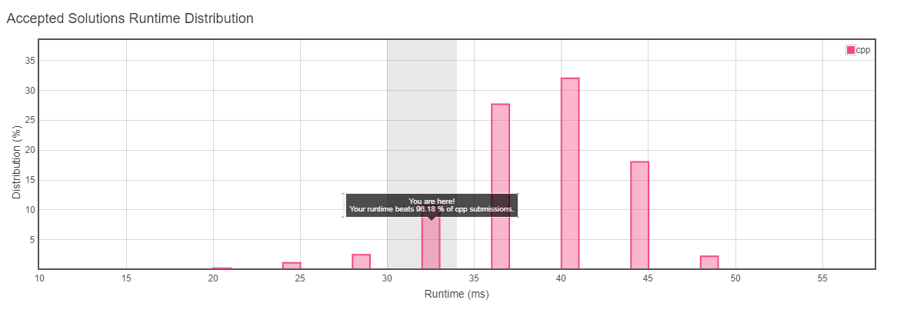
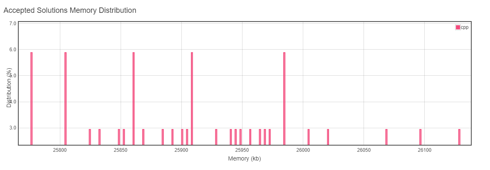

# 235. Lowest Common Ancestor of a Binary Search Tree

```
Runtime: 32 ms Your runtime beats 96.18 % of cpp submissions.
Memory Usage: 23.4 MB Your runtime beats 100 % of cpp submissions.
```
https://leetcode.com/submissions/detail/327569400/   

  
  

Given that the tree is "sorted" (BST) we do need Euler Tour. Just find the items
and compare their paths.  


