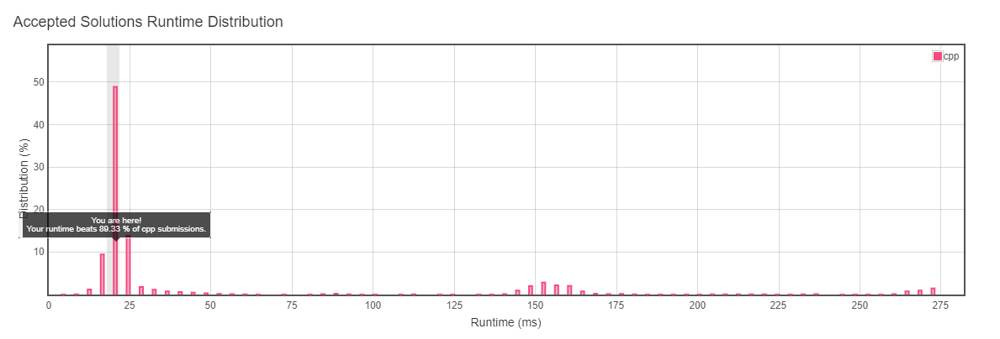
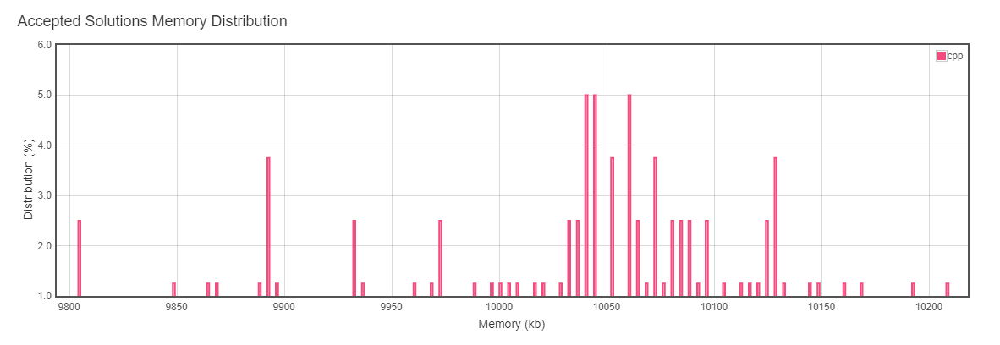
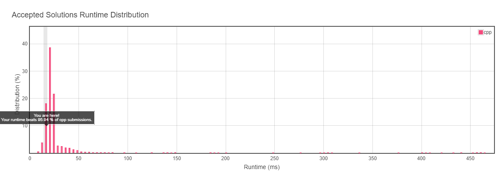
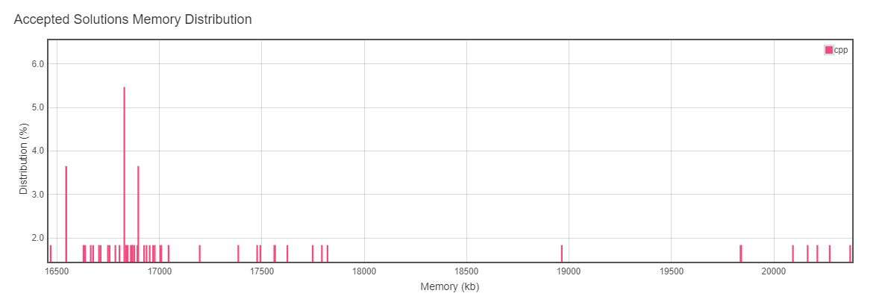
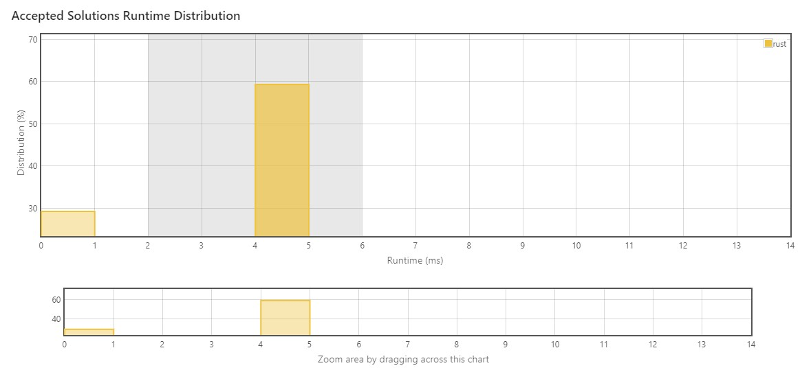
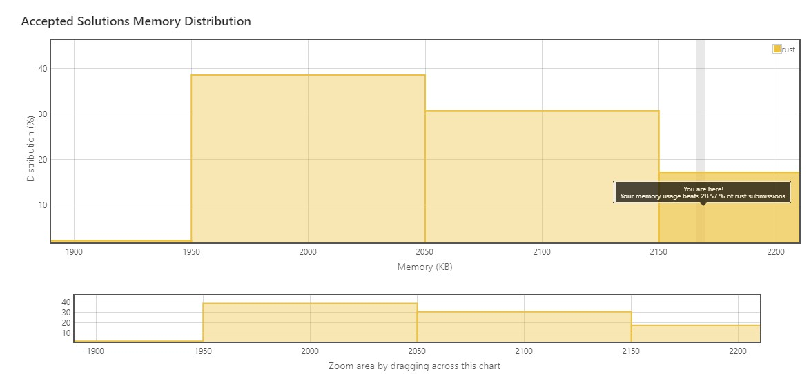
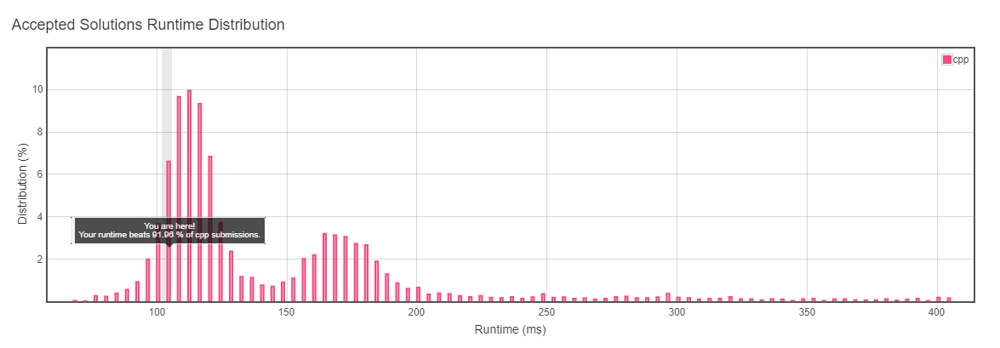
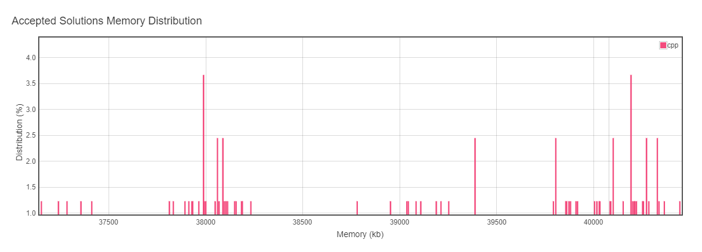
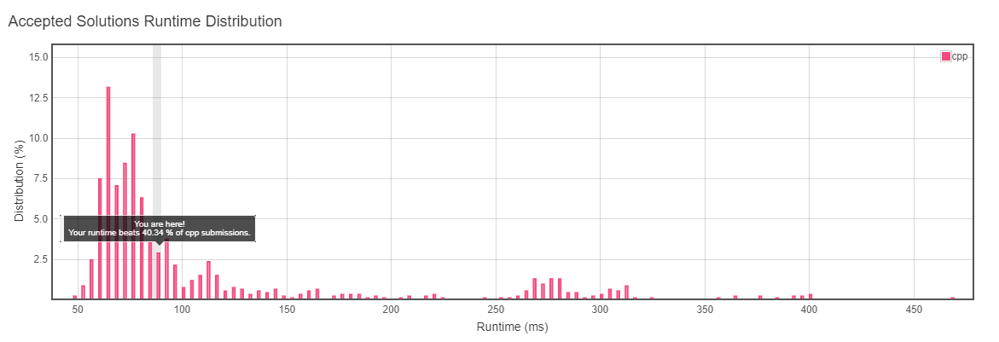
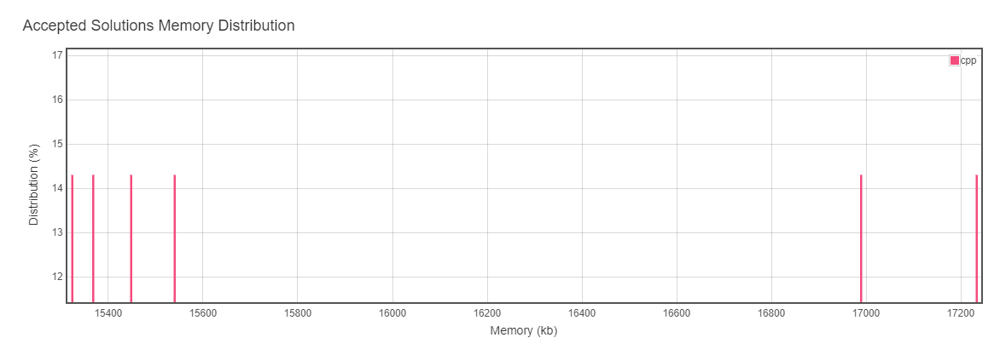

# Submissions

https://leetcode.com/xunilrj/

# Algorithms

## Remove Duplicates from Sorted Array

Runtime: 20 ms  
Memory Usage: 7.6 MB  
https://leetcode.com/submissions/detail/321115997/  




```c++
class Solution {
public:
    int removeDuplicates(vector<int>& nums) {
        auto size = nums.size();
        auto copyTo = 0;
        
        for(int i = 0;i < size;)
        {
            nums[copyTo] = nums[i];
            auto& current = nums[i];
     
            do
            {
                ++i;
            }
            while((i < size) && (current == nums[i]));
            
            ++copyTo;
        }
        
        return copyTo;
    }
};
```

# 235. Lowest Common Ancestor of a Binary Search Tree

```
Runtime: 32 ms Your runtime beats 96.18 % of cpp submissions.
Memory Usage: 23.4 MB Your runtime beats 100 % of cpp submissions.
```
https://leetcode.com/submissions/detail/327569400/   

  
  

[See More](./235-lowest-common-ancestor-of-a-binary-search-tree/) 

## Lowest Common Ancestor of a Binary Tree

```
Runtime: 16 ms (Your runtime beats 95.94 % of cpp submissions.)
Memory Usage: 14.7 MB (Your runtime beats 100 % of cpp submissions.)
```
https://leetcode.com/submissions/detail/327338526/




[See More](./146-lru-cache/Readme.md) 

## Median of Two Sorted Arrays

Rust [see code](./4-MedianOfTwoSortedArrays/main.rs) 
```
Runtime: 4 ms, faster than 70.71% of Rust online submissions for Median of Two Sorted Arrays.
Memory Usage: 2.2 MB, less than 28.57% of Rust online submissions for Median of Two Sorted Arrays.
```
https://leetcode.com/submissions/detail/433660231




# Data Structures

## LRU Cache

Runtime: 104 ms  
Memory Usage: 40.1 MB  
https://leetcode.com/submissions/detail/292957724/  

  
  

[More LRU Cache Details](./146-lru-cache/Readme.md)  
[LRU Cache Tutorial](https://github.com/xunilrj/sandbox/blob/master/sources/cpp/lru/readme.md)  

# Stream processing

## Sliding Window Median

Runtime: 88 ms  
Memory Usage: 15.2 MB  
https://leetcode.com/submissions/detail/322571550/  

  
  

[More LRU Cache Details](./146-lru-cache/Readme.md)  