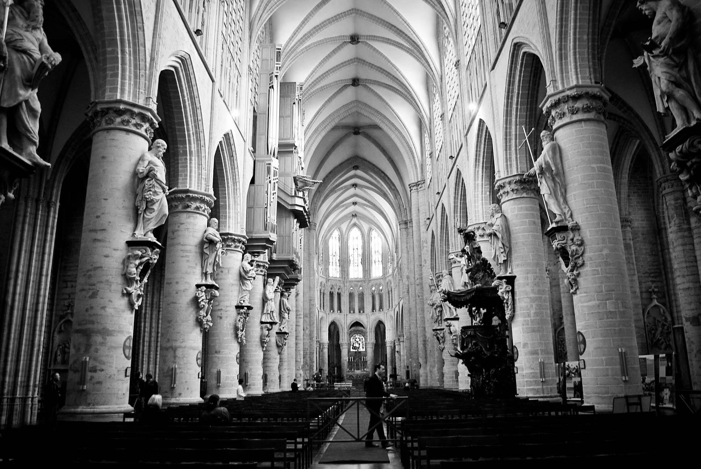
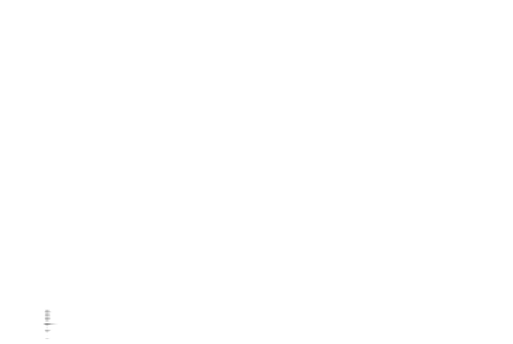
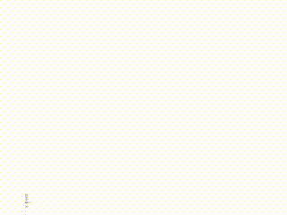

# Singular Value Decomposition

If you ask a mathematician to explain SVD (Singular Value Decomposition), or PCA (Principal Component Analysis), they will probably go around three rounds:

1. First they will make a quick explanation using just layman terms;  
2. they will very quickly get annoyed, but they own explanation and start over again using more mathematician lingo. You will probably get lost. This will lead to the third round;   
3. the blackboard. Now you will get a whole course in Linear Algebra. You will likely find yourself in this situation.

Big Bang Theory Sheldon teaches Penny Physics short version  
https://www.youtube.com/watch?v=sjHRdMCvUMA

To avoid this, I would suggest a more pragmatic approach. Let us dive directly in some practical use for SVD.

# Downloading an image

The first thing we will do is install and use Octave and some packages. This can be very quickly done with:

    Windows
    choco install Octave

    Ubuntu
    sudo apt-get install octave

Now we will start to develop and evolve our script. Our first step is to download an image. We will treat an image as a matrix where each element of the matrix will be the intensity of gray in the image.

Out image will be the beautiful Saint Michael Cathedral in Brussels, Belgium.

    svd.tutorial.m
    imgUrl = "https://static.thousandwonders.net/Cathedral.of.St..Michael.and.St..Gudula.original.28491.jpg";
    urlwrite(imgUrl,"img.jpg");

Now we read the image.

    img = imread("img.jpg");

If you "print" the "img" variable, Octave will already show the image as a "matrix." Hit "q" to stop printing the matrix.

    octave:3> img 
    img = 
        ans(:,:,1) = 
        Columns 1 through 38: 
        65 61 62 67 63 56 61 75 
        66 63 65 70 66 56 59 69 
        70 68 71 75 70 58 55 60 
        70 72 75 77 71 62 53 48 
        69 73 77 75 72 64 52 41 
        66 72 75 72 70 66 53 39 
        64 69 71 66 67 67 56 40 
        62 69 68 63 65 69 57 40 
        53 56 60 63 62 58 53 50 
        warning: broken pipe

The interesting part here is "ans(:,:,1)". This means prints every row (first ":"), every column (second ":") of the first color (the "1"). We have, of course, three color layers (red = 1, green = 2 and blue = 3).

In our case will be simpler to work in grayscale because this will give us just one layer. We can achieve this with:

    imgR = img(:,:,1);
    imgG = img(:,:,2);
    imgB = img(:,:,3);
    grayImg = imgR *0.30 + imgG*0.63 + imgB*0.07;
    imwrite(grayImg, "gimg.jpg");

The magic values 0.3, 0.63, and 0.07 used here to mix the R, G, and B colors exist because not every color has the same intensity. That is why you can "see" a lot more red in some diagrams and maps.

This is our result. Not bad.

Now comes the important part! We will run the SVD algorithm that will return me three matrices. Vt here is just the transpose of V (V' = trans(V))

    [U, S, V] = svd (grayImg);
    Vt = V';

Mathematical theory guarantees me that I can get the "img" matrix again, multiplying the three matrices that the algorithm gives me. This is called "matrix decomposition" in "linear algebra."

    imgCheck = U*S*Vt

We can check if this is true by summing all differences and getting a value close to zero. And this is, in fact, what happens.

    sum( (imgCheck - grayImg)(:) )

OK, but this begs the question "why would I exchange my image, as a matrix, to three other matrices that have no apparent semantic meaning"?

And this is precisely the point; these three matrices DO have a semantic meaning. To avoid jumping into the mathematical explanation that will also appear meaningless, we will give a practical use to these three matrices.

Out first step is to break the multiplication into steps

    [U, S, V] = svd (grayImg);

We all learned that matrix multiplication is done "dot-producting" the rows of the "left operand" with the columns of the "right-operand."

But the truth is that we can also do the opposite. We can multiply columns by vectors. For example:

    octave:20> M1=[1,2;3,4]
    M1 =
        1 2
        3 4
    octave:21> M2=[5,6;7,8]
    M2 =
        5 6
        7 8
    octave:22> M1*M2
    ans =
        19 22
        43 50
    octave:23> M1(:,1)*M2(1,:)+M1(:,2)*M2(2,:)
    ans =
        19 22
        43 50
 
The most significant difference here is that "M1(:,1)*M2(1,:)", the first column of the left operant times the first row of the right operand, generates a matrix and not a single value. So, every step you get a full matrix and sum with the current value you have.

    octave:26> M1(:,1)*M2(1,:)
    ans = 
        5 6 
        15 18
    octave:25> M1(:,2)*M2(2,:)
    ans =
        14 16
        28 32

If you look carefully you will see that [5, 6] * 3 = [15, 18] and [14, 16] * 2 = [28 32]. And [5;15] * 1.2 = [6; 18] and [14; 28] * 1.1429 = [16; 32]. No coincidences here. Every time you multiply a column vector with a row vector you gain a matrix like this one, called Rank-1 matrices.

No going back to the multiplication "U*S*Vt" but now doing it by Rank-1 update (like we did above) we will see something VERY interesting. Let first do just for the first column-row.

    img1 = U(:,1)*S(1,1)*Vt(1,:);
    imwrite(img1, "img1.jpg");
    size(img1) == size(img(:,:,1))

The last line confirms that this multiplication has the same size as our original image. As expected by the Rank-1 update process. Let us see the image:

OK, far from interesting. But this process can be extended for all columns, and we know that at the last column, our matrix will be pixel by pixel equal to our original image. 

The question is, what happens in the intermediary steps. That is what the following code does: it accumulates and save the intermediary steps as images. Hoping to see something interesting.

    function retval = USV(i, U, S, Vt)
        u = U(:,i);
        s = S(i,i);
        vt = Vt(i,:);
        retval = u*s*vt;
    endfunction

    function retval = accumulateUSV(n, U, S, Vt)
        retval = USV(1, U, S, Vt); % first step as we did above
        for i = 2:n
            imgI = USV(i, U, S, Vt); % current Rank-1 matrix
            retval += imgI; % rank-1 update

            imgParcial = retval / i; % only because image must be in [0, 255] range
            %save the image
            imwrite(imgParcial, strcat("img", num2str(i), ".jpg"));
        endfor
        retval /= n; % normalize result
    endfunction

    accumulateUSV(500, U, S, Vt);
 
OK. Now we did 500 steps and generated 500 images. At each image, we are using more and more data from the three matrices that the SVD algorithms gave us. To understand what happens, let us generate a gif from this images.

    ffmpeg -f image2 -i img%d.jpg video.avi
    ffmpeg -i video.avi -vf scale=320:240 small.avi
    ffmpeg -i video.avi -pix_fmt rgb24 out.gif

OK! This IS interesting. There are two essential details.
    1 - We are increasingly getting "closer" to the final image, starting from an almost totally white image;
    2 - It is extremely tough to see what the last steps are doing to this approximation.

Image 500

Original Image

Ignoring the light intensity, it is even hard to see any difference at all between the images. But the vital fact to realize is that the image is named "img500". This means that we used only 500 columns, of 1296 available or 38.58% of the columns.

If calculate how much values we used, we will see that we only used:

    500 * 1296 = 648000 values from the U
    500 * 1936 = 968000 values from the Vt
    500 values from the S
    -------
    Total: 1616500 values

The original image has one value for each pixel and has a size of 1296 * 1936 = 2509056
This means:

    1616500 / 2509056

Or 64% of the original image. 

Freeze, punk!! Have we created a compression algorithm? And the answer is, "Yes!"

We created a very similar image using only 64% of the data, although we should remember that this is a lossy compression. The "img500.jpg" has "less" information than the original "img.jpg."

Of course that we can more easily generate the img500.jpg just slicing the SVD matrices like this.

    u500 = U(:,1:500);
    s500 = S(1:500,1:500);
    vt500 = Vt(1:500,:);
    img500 = u500*s500*vt500 / 500;
    imwrite(img500, "img500D.jpg");

This means that "u500*s500*vt500" is an approximation (using 30% less data) than the original "img." In Linear Algebra lingo, this compression is called "dimensionality reduction" because you are using just 500 dimensions, instead of 1296. But in this process of reducing the dimensionality of our problem, we cannot choose any 500 dimensions of the 1296 available. Otherwise, we could end up with the 500-worst dimensions.

This brings up a fundamental point: what would be the 500-worst dimensions? Even better, what would be the 500-best dimensions? 

Well, if we know that "u500*s500*vt500" is an approximation to "img," this means that we know that these two matrices are not equal. If on top of that, we increase the analysis to have, somehow, a sense of "distance" between two matrices, we could, at least in theory, analyze all 500-dimension combinations of the 1296 available and choose the one with the minimum "distance." That would be the best 500 dimensions.

Looks like an easy task. Let us remember from Combinatorics that this is "1296 choose 500," and the result is...

Number of combinations: 4.802407E+373
48024075015949887460283183737882145730748198980437313658842521598777280380991964093968472454723601255276117585176032665760066647077064440327420233175841301801930222304205942095872256452970158147392398704116723309624153748167447389056261489321063282538761570934398536756601728003630279092320374582204950926562081727840231311822973738159464496332414503771239076328012121532160

Err... Well... we will have to use another method... and this method is: the SVD. The best 1-dimension approximation of the "img" is "u1*s1*vt1". Exactly our first image. Let us take another look at it.

Not very impressive, but what would you expect with using just 1 of 1296 dimensions? This first best dimension corresponds to the first column of U, the first item in the diagonal of S and the first row of Vt. They are the "principal singular vectors" and the "principal singular value" of the "img" matrix.

If we follow until the n-th column using this method, we get the "n" most important singular vector and singular values. We can call them the principal components of our original matrix, in our case, our image.

## Complete Code

    imgUrl = "https://static.thousandwonders.net/Cathedral.of.St..Michael.and.St..Gudula.original.28491.jpg";
    urlwrite(imgUrl,"img.jpg");

    % create grayscale image
    img = imread("img.jpg");
    imgR = img(:,:,1);
    imgG = img(:,:,2);
    imgB = img(:,:,3);
    grayImg = imgR *0.30 + imgG*0.63 + imgB*0.07;
    imwrite(grayImg, "gimg.jpg");

    % run SVD
    [U, S, V] = svd (grayImg);
    Vt = V';

    % checking theory
    imgCheck = U*S*Vt
    sum( (imgCheck - grayImg)(:) )

    % generate img1
    img1 = U(:,1)*S(1,1)*Vt(1,:);
    imwrite(img1, "img1.jpg");
    size(img1) == size(img(:,:,1)) % check size

    % generate img500
    
    function retval = USV(i, U, S, Vt)
        u = U(:,i);
        s = S(i,i);
        vt = Vt(i,:);
        retval = u*s*vt;
    endfunction

    function retval = accumulateUSV(n, U, S, Vt)
        retval = USV(1, U, S, Vt); % first step as we did above
        for i = 2:n
            imgI = USV(i, U, S, Vt); % current Rank-1 matrix
            retval += imgI; % rank-1 update

            imgParcial = retval / i; % only because image must be in [0, 255] range
            %save the image
            imwrite(imgParcial, strcat("img", num2str(i), ".jpg"));
        endfor
        retval /= n; % normalize result
    endfunction

    accumulateUSV(500, U, S, Vt);

    % another possible implementation of img500

    u500 = U(:,1:500);
    s500 = S(1:500,1:500);
    vt500 = Vt(1:500,:);
    img500 = u500*s500*vt500 / 500;
    imwrite(img500, "img500D.jpg");

